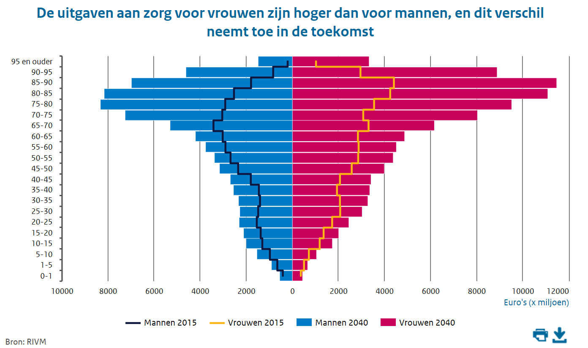

# Reproducing a colourful visualization with ggplot

On [https://www.vtv2018.nl/zorguitgaven](https://www.vtv2018.nl/zorguitgaven) a nice visualization was publiced on zorguitgaven (healthcare expenses):

Using the data provided online, I reproduced this visualization with ggplot.  

